<p align="center">
  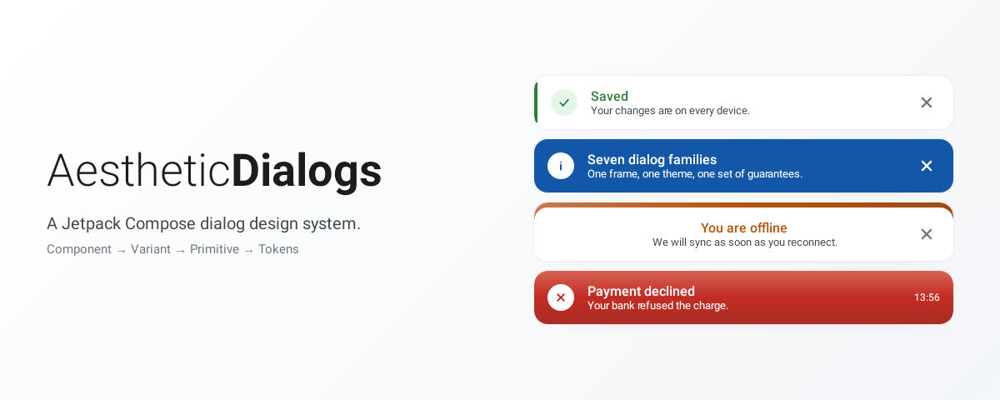
</p>

# AestheticDialogs

[](https://www.android.com)
[](https://android-arsenal.com/api?level=24)
[](https://www.apache.org/licenses/LICENSE-2.0.html)

A **Jetpack Compose dialog design system**, built on the three-layer UI
architecture (Component → Variant → Primitive → Tokens).

Version 2.x is a rewrite. Where 1.x offered eight decorated `AlertDialog`s, 2.x
offers seven component families — six dialogs and a set of banners — that share
one frame, one theme and one set of accessibility guarantees — plus the visual identity the library has always had.

> Coming from 1.x? Start with the [migration guide](docs/MIGRATION.md).

---

## Contents

- [Why it exists](#why-it-exists)
- [Install](#install)
- [Quick start](#quick-start)
- [The dialogs](#the-dialogs)
- [Notifications](#notifications)
- [Theming](#theming)
- [Architecture](#architecture)
- [Accessibility](#accessibility)
- [Catalog](#catalog)
- [Contributing](#contributing)
- [License](#license)

---

## Why it exists

Every Android app writes the same dialogs, and writes them slightly differently
each time: one forgets the loading state, another lets you cancel a half-finished
delete, a third is 300dp wide on a tablet, a fourth announces nothing to
TalkBack.

AestheticDialogs does that work once. What it gives you is not "a nicer
`AlertDialog`" — it is a set of dialogs that are already correct about the
things that are easy to get wrong:

- **adaptive** — the width comes from the space available, not from a device check;
- **accessible** — pane titles, headings, live regions, 48dp targets, 200% font;
- **stateless** — the library never decides that your dialog should close;
- **themed** — one wrapper, light and dark, brandable by copying a value;
- **quiet under reduced motion** — transitions become cuts when the user asks;
- **light** — no icon library, no drawable resources, and Material 3 never in a
  public signature, so you never have to write Material to use the library.

---

## Install

```kotlin
// settings.gradle.kts — Maven Central is already there in most projects
dependencyResolutionManagement {
    repositories {
        google()
        mavenCentral()
    }
}
```

```kotlin
// build.gradle.kts
dependencies {
    implementation("com.gabrielthecode:aestheticdialogs:2.0.0")
}
```

Or through a version catalog:

```toml
# gradle/libs.versions.toml
[versions]
aestheticdialogs = "2.0.0"

[libraries]
aestheticdialogs = { module = "com.gabrielthecode:aestheticdialogs", version.ref = "aestheticdialogs" }
```

```kotlin
dependencies {
    implementation(libs.aestheticdialogs)
}
```

Requires `minSdk 24` and a Compose-enabled module. Material 3 is *not* forced on
you — the library keeps it as an implementation detail.

---

## Quick start

Wrap your app once, **inside** your own theme:

```kotlin
setContent {
    MyAppTheme {                 // yours: untouched
        AestheticDialogsTheme {  // ours: four CompositionLocals, nothing else
            AppNavHost()
        }
    }
}
```

Optional, in fact — components resolve light or dark from the system setting when
no theme is present. Wrapping is what lets you brand them.

Then a dialog is a function of your state:

```kotlin
if (uiState.showDeleteConfirmation) {
    AestheticConfirmationDialog(
        uiModel = ConfirmationDialogUiModel.Destructive(
            title = "Delete this album?",
            message = "The 24 photos inside it will be deleted too.",
            confirmLabel = "Delete album",
            cancelLabel = "Keep it",
            isConfirming = uiState.isDeleting,
        ),
        onSignal = { signal ->
            when (signal) {
                ConfirmationDialogSignal.Confirmed -> viewModel.deleteAlbum()
                ConfirmationDialogSignal.Cancelled,
                ConfirmationDialogSignal.Dismissed -> viewModel.dismissDialog()
            }
        },
    )
}
```

There is no `show()` and no `dismiss()`. The dialog is on screen while it is in
the composition, and every signal — including `Dismissed` — is a request you
decide what to do with.

---

## The dialogs

Every image below is rendered from the real component by
`scripts/generate-docs-images.sh`, so it cannot drift from the library.

### Confirmation — ask before doing something

Two variants: `Default` for ordinary questions, `Destructive` for things that
cannot be undone. The destructive treatment is guaranteed rather than
configured, so a delete confirmation cannot accidentally ship with a neutral
button.

```kotlin
AestheticConfirmationDialog(
    uiModel = ConfirmationDialogUiModel.Default(
        title = "Leave without saving?",
        message = "Your draft has unsaved changes.",
        confirmLabel = "Leave",
        cancelLabel = "Keep editing",
    ),
    onSignal = { signal ->
        when (signal) {
            ConfirmationDialogSignal.Confirmed -> viewModel.discardDraft()
            ConfirmationDialogSignal.Cancelled,
            ConfirmationDialogSignal.Dismissed -> viewModel.dismissDialog()
        }
    },
)
```

`isConfirming = true` puts a spinner on the confirm button and locks the rest of
the dialog — including cancel, so a half-finished operation cannot be abandoned
mid-flight.

| Default | Destructive | Confirming |
|---|---|---|
| 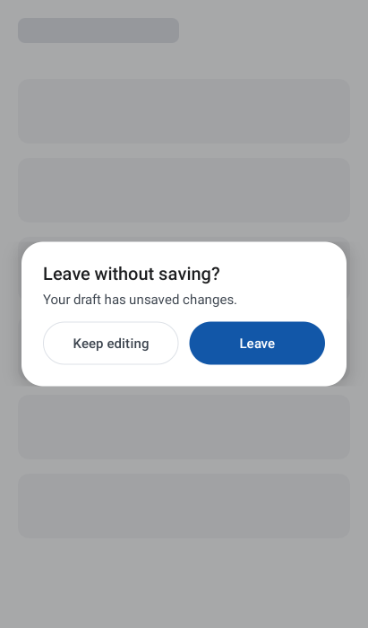 | 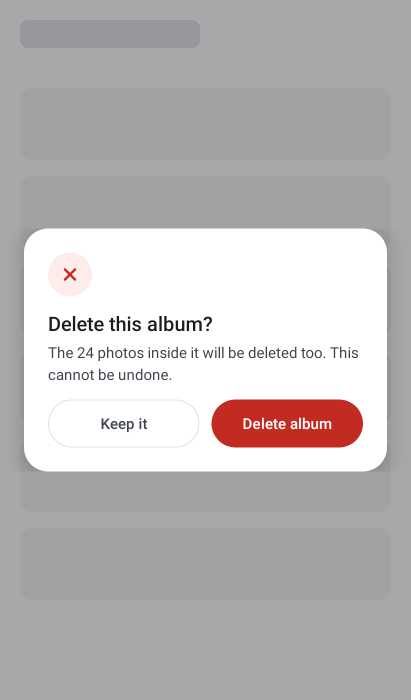 |  |

### Alert — tell them something, offer a way forward

```kotlin
AestheticAlertDialog(
    uiModel = AlertDialogUiModel.Default(
        title = "You are offline",
        message = "We will sync your changes as soon as you reconnect.",
        tone = DialogTone.Warning,
        primaryAction = DialogAction("Retry"),
        secondaryAction = DialogAction("Dismiss", DialogActionEmphasis.Text),
    ),
    onSignal = { signal ->
        when (signal) {
            AlertDialogSignal.PrimaryActionClicked -> viewModel.retry()
            AlertDialogSignal.SecondaryActionClicked,
            AlertDialogSignal.Dismissed -> viewModel.dismissDialog()
        }
    },
)
```

This is also the error, offline and permission-required pattern. They are the
same dialog with a different tone and action label, and shipping three
near-identical components would have been three ways to get one thing wrong.

| Warning | Error |
|---|---|
| 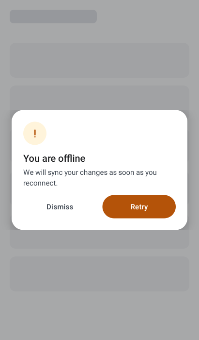 | 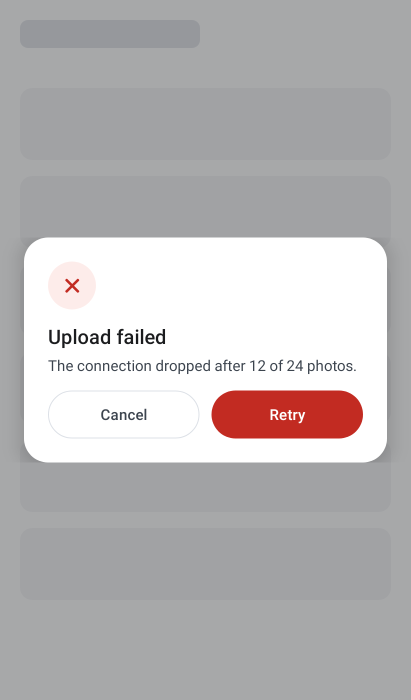 |

### Selection — pick one, or several

```kotlin
AestheticSelectionDialog(
    uiModel = SelectionDialogUiModel.Multiple(
        title = "Notify me about",
        items = uiState.filteredTopics,     // you filter
        selectedIds = uiState.selectedIds,  // you own the selection
        searchQuery = uiState.query,        // you own the query
        confirmLabel = "Save",
        cancelLabel = "Cancel",
        emptyText = "Nothing matches “${uiState.query}”.",
    ),
    onSignal = { signal ->
        when (signal) {
            is SelectionDialogSignal.ItemClicked -> viewModel.toggleTopic(signal.id)
            is SelectionDialogSignal.SearchQueryChanged -> viewModel.search(signal.query)
            SelectionDialogSignal.Confirmed -> viewModel.saveTopics()
            SelectionDialogSignal.Cancelled,
            SelectionDialogSignal.Dismissed -> viewModel.dismissDialog()
        }
    },
)
```

The dialog renders and reports; it never filters, sorts or toggles. That is what
lets the same component handle five static options and a remote search over ten
thousand rows. Long lists are lazy, and the action row stays pinned.

| Single | Multiple, with search |
|---|---|
| 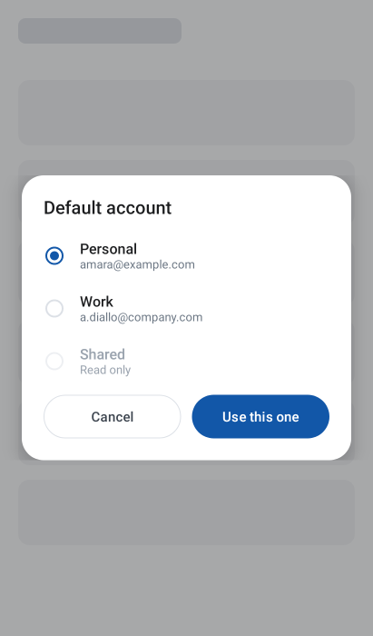 | 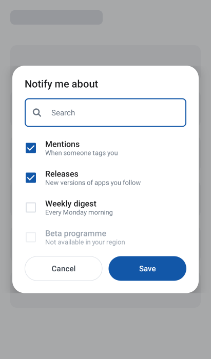 |

### Input — ask for one value

`Text` and `Password` variants. The field takes focus on open, the keyboard's
done action confirms, the dialog lifts above the keyboard, and the reveal toggle
survives rotation. Validation is yours: pass `errorText` and set
`isConfirmEnabled`.

```kotlin
AestheticInputDialog(
    uiModel = InputDialogUiModel.Text(
        title = "Rename album",
        value = uiState.name,
        label = "Album name",
        errorText = uiState.nameError,
        confirmLabel = "Rename",
        cancelLabel = "Cancel",
        isConfirmEnabled = uiState.nameError == null,
    ),
    onValueChange = viewModel::onNameChange,
    onSignal = { signal ->
        when (signal) {
            InputDialogSignal.Confirmed -> viewModel.renameAlbum()
            InputDialogSignal.Cancelled,
            InputDialogSignal.Dismissed -> viewModel.dismissDialog()
        }
    },
)
```

| Text | Invalid | Password |
|---|---|---|
| 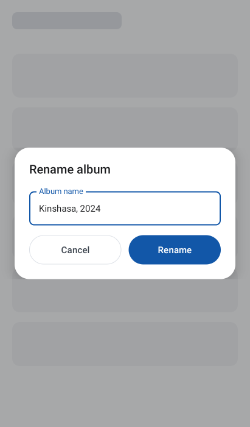 | 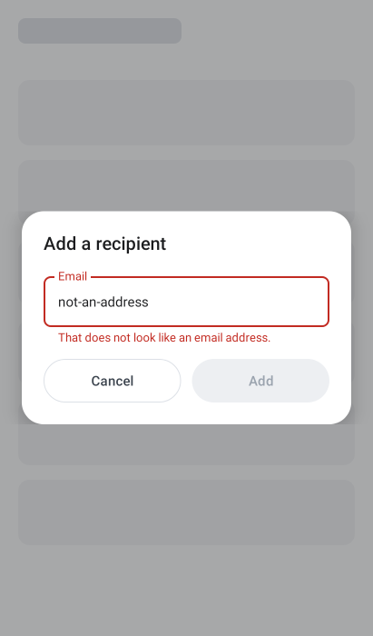 | 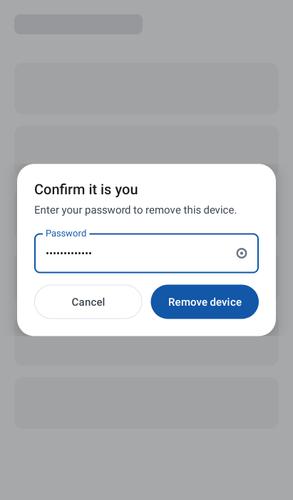 |

### Rich content — your content, our frame

```kotlin
AestheticContentDialog(
    uiModel = ContentDialogUiModel.Default(
        title = "Before you continue",
        primaryAction = DialogAction("I agree"),
        secondaryAction = DialogAction("Not now", DialogActionEmphasis.Text),
    ),
    onSignal = { … },
) {
    ConsentSummary(uiState.consent)
}
```

The middle is yours. The window, adaptive width, scrim, dismissal contract,
header, actions and accessibility pane stay with the design system — which is the
difference between an escape hatch and a raw `Dialog {}`.

<p align="center">
  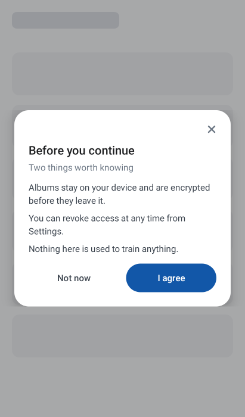
</p>

### Feedback — the 1.x dialogs, rebuilt

`Flat` (card) and `Flash` (gradient panel), in all five tones. The Flash gradient
is derived from the tone accent, so a rebranded theme keeps it consistent — and
warning and info finally have one.

```kotlin
AestheticFeedbackDialog(
    uiModel = FeedbackDialogUiModel.Flash(
        title = "Message sent",
        message = "It will arrive even if you close the app.",
        tone = DialogTone.Success,
        actionLabel = "Nice",
    ),
    onSignal = { viewModel.dismissDialog() },
)
```

| Flat | Flash, success | Flash, error |
|---|---|---|
| 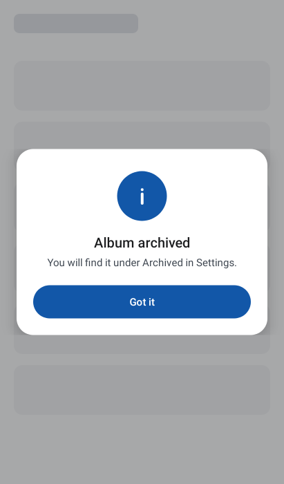 | 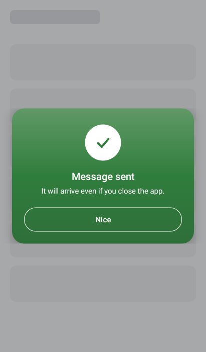 | 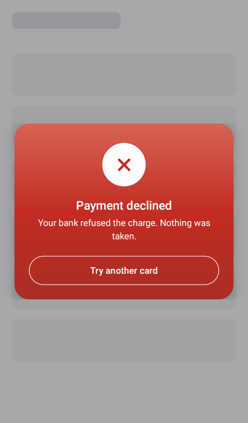 |

---

## Notifications

The five edge-anchored 1.x styles — Toaster, Rainbow, Connectify, Emoji, Emotion
— are no longer dialogs. They were never modal in spirit, and rendering them as
windows meant an informational toast dimmed the screen, stole focus and swallowed
the back gesture.

```kotlin
Box(Modifier.fillMaxSize()) {
    HomeContent()

    AestheticNotificationHost(
        notification = uiState.banner,
        onSignal = { viewModel.dismissBanner() },
        alignment = NotificationAlignment.Top,
        animation = AestheticNotificationAnimation.Slide,
        autoDismissMillis = 4_000,
    )
}
```

| | |
|---|---|
| **Toaster** — tone bar down the leading edge | 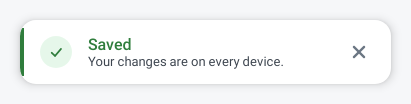 |
| **Rainbow** — tone-filled, inverted copy | 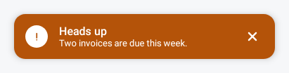 |
| **Connectify** — centred, under a tone rim | 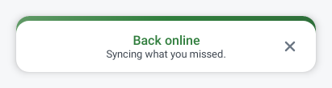 |
| **Emoji** — a character, not a bitmap | 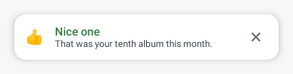 |
| **Emotion** — gradient card with a timestamp | 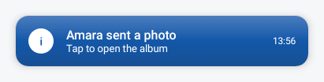 |

Banners are live regions, so screen readers announce them without the user having
to go looking. Because the host owns nothing but the exit transition, they are
the one place in the library with a full enter *and* exit animation:

| `Slide` | `Fade` | `Scale` |
|---|---|---|
| 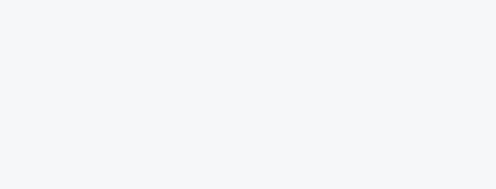 |  |  |

---

## Theming

Wrap once, **inside** your own theme:

```kotlin
MyAppTheme {                 // yours: untouched
    AestheticDialogsTheme {  // ours: four CompositionLocals, nothing else
        AppNavHost()
    }
}
```

`AestheticDialogsTheme` installs no `MaterialTheme`. It provides the library's
own tokens and leaves your colour scheme, type scale and shapes exactly as they
were — so wrapping your whole application is safe, and your own composables
inside an `AestheticContentDialog` still look like yours. The handful of Material
components the library draws with are passed their colours explicitly.

Already have a brand? One line:

```kotlin
AestheticDialogsTheme(
    colors = aestheticLightColors().withBrand(
        primary = MaterialTheme.colorScheme.primary,
        onPrimary = MaterialTheme.colorScheme.onPrimary,
    ),
) {
    AppNavHost()
}
```

`withBrand` takes plain `Color`s, not a Material `ColorScheme`, so Material 3
stays out of your compile classpath and out of this library's API. It moves the action colour, the
surface and the focus ring — and deliberately **not** the status tones: an error
has to look like an error in every application.

For finer control, copy the scheme:

```kotlin
AestheticDialogsTheme(
    colors = aestheticLightColors().copy(
        action = aestheticLightColors().action.copy(primary = BrandBlue),
    ),
    shapes = AestheticShapes(dialog = RoundedCornerShape(4.dp)),
    typography = AestheticTypography(title = MyBrandTitleStyle),
) {
    AppNavHost()
}
```

Precedence is `library defaults → theme → UI model`. Colour, type, shape and
motion are themeable because they express a brand; spacing and dimensions are not,
because they express the structure of the components.

Tokens are public and semantic: `AestheticDialogsTheme.colors.status.error.accent`,
`AestheticSpacing.lg`, `AestheticDimens.minTouchTarget`. Raw hues are internal, so
dark mode is a remapping rather than a second implementation.

No dynamic colour, deliberately: a design system exists so a warning looks like a
warning.

| Alert | Selection | Banners |
|---|---|---|
| 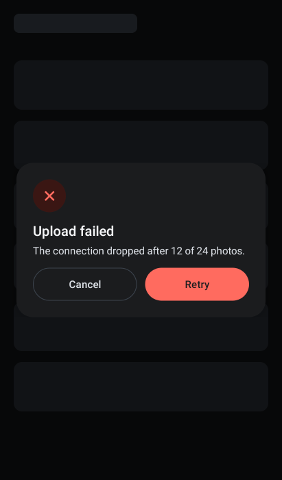 | 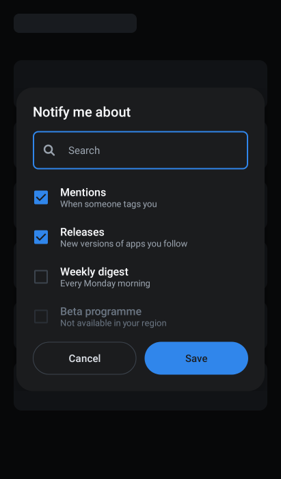 | 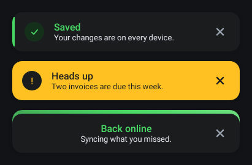 |

---

## Architecture

```
Component  (public)    AestheticConfirmationDialog — dispatches on the UI model
    ↓
Variant    (internal)  ConfirmationDialogDestructive — resolves semantics
    ↓
Primitive  (internal)  DialogFramePrimitive — window, scrim, width, a11y, layout
    ↓
Tokens     (public)    AestheticColors, AestheticSpacing, AestheticMotion …
```

`explicitApi()` plus `internal` makes the boundary a compiler rule: consumers
*cannot* import a variant or a primitive.

Full detail in [docs/ARCHITECTURE.md](docs/ARCHITECTURE.md), including why modal
dialogs animate in but not out, why the selection model is not `@Immutable`, and
why two dialogs express their actions differently. The audit of 1.x that drove
the rewrite is in [docs/ARCHITECTURE_AUDIT.md](docs/ARCHITECTURE_AUDIT.md).

---

## Accessibility

Not a checklist item — it is most of why the rewrite happened.

| | |
|---|---|
| Screen readers | `paneTitle` on every dialog, headings on titles, live regions on banners (assertive for errors) |
| Selection | Row-level `selectable`/`toggleable` with roles, so a row is announced once and correctly |
| Targets | Every interactive element at least 48dp |
| Text | All type in `sp`; the layouts most likely to break carry a 200% font-scale preview, and one is held by a screenshot baseline |
| Motion | Transitions become cuts when the platform animation scale is zero |
| Colour | Every tone carries a distinct drawn mark as well as a hue; accents clear 4.5:1 in both shipped schemes |
| Focus | The input dialog moves focus to its field on open |

---

## Catalog

The `:app` module is a component catalog that consumes the library through its
published API only — which makes it the cheapest test of whether that API is
sufficient. It covers every component, every tone, both themes, long content,
loading, empty and error states.

```
./gradlew :app:installDebug
```

---

## Contributing

```
./gradlew build                     # compile, lint, unit + interaction tests
./gradlew recordRoborazziDebug      # record screenshot baselines
./gradlew verifyRoborazziDebug      # check them
./gradlew apiDump                   # update api/aestheticdialogs.api after an API change
./gradlew spotlessApply             # format
scripts/generate-docs-images.sh     # redraw everything in docs/images
```

The documentation images are rendered on the JVM from the real components — no
emulator, no screen recorder, byte-identical on every machine. Adding a dialog
means adding a case to `Docs*.kt` in the library's test source set; the README and
this README then updates itself.

Adding a dialog or a variant: [docs/ARCHITECTURE.md §12](docs/ARCHITECTURE.md).
General guidelines: [CONTRIBUTING.md](CONTRIBUTING.md).

---

## License

```
Copyright 2019 TEKOMBO Gabriel

Licensed under the Apache License, Version 2.0 (the "License");
you may not use this file except in compliance with the License.
You may obtain a copy of the License at

   http://www.apache.org/licenses/LICENSE-2.0

Unless required by applicable law or agreed to in writing, software
distributed under the License is distributed on an "AS IS" BASIS,
WITHOUT WARRANTIES OR CONDITIONS OF ANY KIND, either express or implied.
See the License for the specific language governing permissions and
limitations under the License.
```
